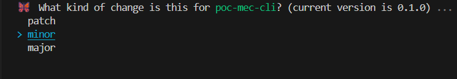
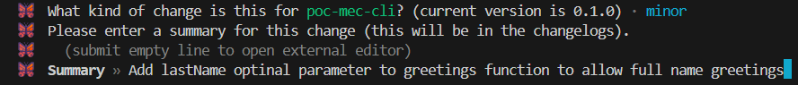

# POC changeset
[Changesets](https://akinoccc.github.io/changesets/) é uma ferramenta que ajuda com o gerenciamento de versões SemVer e na geração de changelogs

Neste repo temos 2 pacotes:

[poc-mec-cli](./packages/poc-mec-cli/README.md): ferramenta que vamos utlizar o changesets para gerenciamento das versões e geração do changelog.

[app](./packages/app/README.md): aplicação simples para testar a ferramenta poc-mec-cli

# Como testar o changesets neste repo?

1- Faça sua alteração na ferramenta, adicone uma nova função, modifique contratos e tipos.

2- Adicione um changeset

 Execute o comando `npm run changesets:add` e selecione o tipo da versão de acordo com o SemVer.
 

 Adicione uma descrição para suas mudanças
 

3- Dê push nas alterações.

A ideia principal ate aqui é permitir que desenvolvedores alterem o contrato da ferramenta para então, em um momento definido sera realizado o bump da versão da ferramenta.

    Imagine se a ferramenta estiver na versão `1.1.0` e 4 desenvolvedores realizam mudanças major na ferramenta e apos a mudança publique o pacote. O pacote irá para a versão `5.0.0` de uma única vez.
    Outra questão é: como explicar para os usuários da ferramenta todas as mudanças que foram feitas nas versões 2, 3 e 4 ?
    R: Por isso utilizamos ferramentas como o changesets. Tais ferramentas permite introduzir um processo que facilita a geração dos changelogs.

4- Gere o changelog e realize o bump das versões dos pacotes

Execute o comando `npm run changeset:version` para isso. Ele irá deletar todos os changesets gerados no passo 2 e gerar o arquivo de changelog.

5- realize o push do bump

6- Publique o pacote npm
Execute `changeset:publish` para publicar o pacote npm e gerar a git tag.

Realize o push da tag `git push --tag`